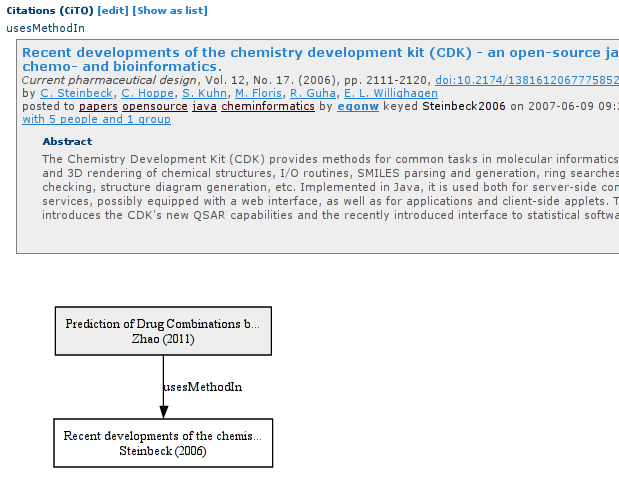

# Adoption of the Citation Typing Ontology by the Journal of Cheminformatics

Egon Willighagen, 0000-0001-7542-0286, Dept of Bioinformatics - BiGCaT, NUTRIM, Maastricht University

We cite other literature for many reasons. The reasons are normally positive: it supports a statement
we make in our article, the new work extends on earlier ides, or the cited paper outlines a method
or a data set we use. Sometimes, however, we cite an article differently. For example, because we
disagree with the conclusions from that article. 
Citations help us find more information about a concept, and allow individual journal article
to focus on the new content. Furthermore, they position the new work on its historical context
and citation analyses can point us to research topics we would otherwise not have
thought of [<cite>Q57338674</cite>].

Of course, citations have found additional uses that stem from the idea that articles that are
cited a lot may be important. Would we assume that all citations to an article are positive,
this is a logical conclusion. However, citations are not always positive. We can cite an article
because we disagree with the statements. For example, a 2011 paper in Science about the possible uptake
of arsenate ions in DNA has seen mostly disagreeing citations [<cite>Q21706159</cite>].

Ten years ago, Shotton *et al.* published an ontology
that formalizes a hierachy of reasons: the Citation Typing Ontology (CiTO) [<cite type="usesMethodIn">Q21198690</cite>]. 
This ontology defines a citation as the act of citing some article. That allows one to make
statements about the citation, in a machine readable way. Using the CiTO we can say the
citation is neutral (*cito:citesAsAuthority*), positive (*cito:confirms*), or negative (*cito:disagreesWith*).
The ontology also allows us to indicate reuse of methods and software (*cito:usesMethodIn*) and data (*cito:usesDataFrom*).
This, of course, is closely related to recent efforts in data citation [<cite>Q58333293</cite>]
and software citation [<cite>Q26941501</cite>].
The adoption of the CiTO, however, has so far not been wide in publishing. CiteULike [<cite type="citesAsAuthority">Q96278749</cite>] was one of
the first tools that had support [<cite>WIL2010</cite>]. It allowed users to create citations with CiTO typing
(see Figure&nbsp;1).

  
Figure&nbsp;1: Screenshot of CiteUlike showing the citation between two articles and that the reason is that
the citing article uses the method proposed in the cite article (*cito:usesMethodIn*).

# Adopting the CiTO

If the past 10 years has shown anything, it is that the activity of scholarly communication via journal articles is
not easily changed. Whether it is widespread adoption of data repository, minimal reporting standards, or
freely sharing citations, the interest is there, but the uptake is slow. The OpenCitations project
[<cite>Q26271531</cite>,<cite type="citesAsAuthority">Q86246929</cite>] and Initiative for Open Citations [<cite type="citesAsAuthority">Q29189885</cite>]
show how hard it is to change the momentum. And while CiteULike introduced support for
the CiTO, other references managers have not (yet). A chicken-and-egg situation may be an underlying issue:
if there are no providers of CiTO annotation, why should tools that work with citations use it? And at the
same time, or there is no us of it, why invest effort to provide such annotation.

However, the Journal of Cheminformatics finds adoption important. For example, we may want to learn what
articles are using a method proposed in some article. We may want to see how data is reused. And we may
want to get warned that we are citing an article that has been refuted repeatedly.

Therefore, we are starting a pilot to roll out CiTO annotation in the Journal of Cheminformatics. We
take advantage here of the ability to add notes to *full form* (see [<cite>Q21198690</cite>])
references in bibliographies. These are referred to as *bibnotes*.
This feature hass not been used by the Journal of Cheminformatics otherwise.
The content of the note will be strictly formatted: it will use the syntax *[cito:usesMethodIn]*.
That is, the bibnote starts with the *[* character, followed by one of the CiTO types, and ending
with the *]* character.
By using this specific syntax, we introduce a level of machine readability that this annotation can
be extracted with text mining approaches and used by downstream citation projects.

These bibnotes can be used to overwrite the default *cito:cites*. We currently encourage
authors interested in participating in this pilot to use the following CiTO types: *cito:citesAsDataSource*
when you use data in your paper from the cited source, *cito:usesMethodIn* when you use a method
from the cites source, *cito:citesAsAuthority* for articles that you cite as authorative works
in the field, *cito:discusses* when you discusse the content of the cited article, and
*cito:extends* when your article describes a new realease of software or database described
in the cited article. However, you are free to use any of the other CiTO types, including
*cito:agreesWith* and *cito:disagreesWith*.

We also plan to adopt this approach for comments (*cito:repliesTo*) and corrigenda (*cito:cito:updates*).
These annotation will be handled at an editorial level.

With this pilot we hope to trigger further adoption of approaches like CiTO. We plan 
to use this information in Wikicite [<cite>Q28843308</cite>] and Scholia [<cite type="citesAsAuthority">Q41799194</cite>]
to demonstrate downstream use,
but hope that projects like OpenCitations and SciGraph
([www.springernature.com/gp/researchers/scigraph](https://www.springernature.com/gp/researchers/scigraph)
will pick it up too.
Let his be the egg or chicken (depending on your philosophy) we are looking for to innovate
how we cite our literature.

## References

<references/>
